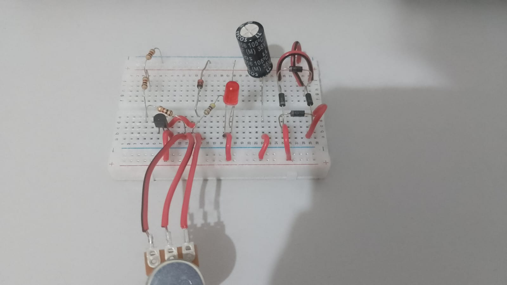

# fonte-ajustavel-3v-12v-100mA
## Projeto desenvolvido para a disciplina de Eletrônica.
## Objetivo:
Projetar e montar uma fonte de tensão ajustável, capaz de fornecer uma saída variável entre 3V e 12V, com corrente máxima de 100mA.

## Grupo:
- David Icheng Wang Chou - 16861870
- Erik Min Soo Chung - 15450334
- Gabriel Moura - 16867383
- Luís Henrique Fonseca Aguilar - 16885720
- Marcelo da Silva Zanata - 16831070

## Componentes Eletrônicos
| Quantidade     | Componente | Descrição | Valor |
| ---   | ---                 | ---                | ---      |
| 1 	| [Transformador] 	  | 18 V			   | R$ 0,00  |
| 1     | [Protoboard] 		  | Pequena 400 furos  | R$ 21,70  |
| 1     | [Capacitor] 	      | 470 uF / 35 V      | R$ 2,80  |
| 1     | [Potenciômetro]     | 10 kΩ 1 W 	       | R$ 7,00  |
| 3     | [Resistor] 	      | 1 kΩ 1/4 W         | R$ 0,70  |
| 1     | [Resistor] 	 	  | 460 Ω 1/4 W         | R$ 0,70  |
| 1     | [Resistor]          | 5.6 kΩ 1/4 W       | R$ 0,70  |
| 1     | [Diodo Zener]       | 13V 1 W            | R$ 0,50  |
| 1     | [LED] 			  | 5mm vermelho       | R$ 0,50  |
| 1     | [Transistor] 		  | NPN 2N3904   	   | R$ 1,60  |
| 4 	| [Diodo Retificador] | 1N4007 		       | R$ 2,00  |
| 1     | [Jumper]        | Macho/Macho        | R$ 0.00  |

Valor Total: R$ 38,20

## Vídeo Explicando o Projeto
[Link para o vídeo no YouTube](https://youtu.be/FGgIoPbJn9w)

## Imagem do Circuito

## Projeto no Falstad
[Link para o projeto](https://tinyurl.com/245nzmpe)

## Imagem do Projeto Finalizado

## Projeto no Eagle

## Cálculo dos componentes

